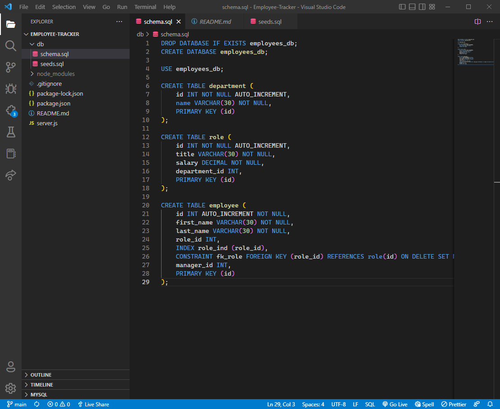

# Employee Tracker

## Table of Contents
1. [Description](#description)
2. [Installation](#installation)
3. [Testing](#testing)
4. [Contribution](#contribution)
5. [Mock-Up](#mock-Up)
6. [Application](#application)
7. [License](#license)
8. [Contact](#contact)

## Description
The purpose of this application was to create a command line app to manage a company's employee database, using Node.js, Inquirer, and MySQL.

## Installation
To install dependencies, the user should run ``` npm i ``` to install .json packages, as well as ``` npm start ``` to start the server.

## Testing
No tests written for this project.

## Contribution
Currently not accepting contributions to the Repo.

## Mock-Up
()

## Demo Video
https://drive.google.com/file/d/1uXZdI5mjaguwTTNitKbh0FlG1_iTZ9TC/view


## License
Please see https://mit-license.org/ to get info about this license


## Contact
Email: jasadowski7@gmail.com
GitHub: https://github.com/jsadowski7
